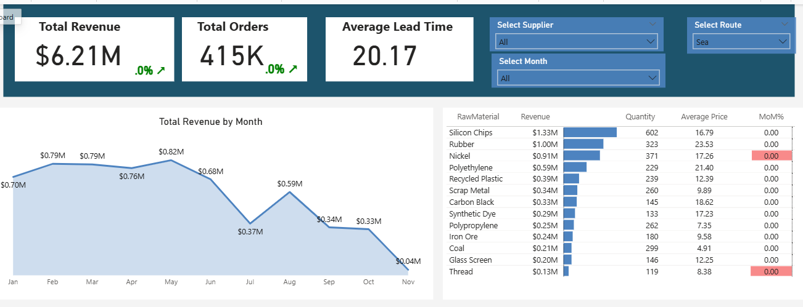
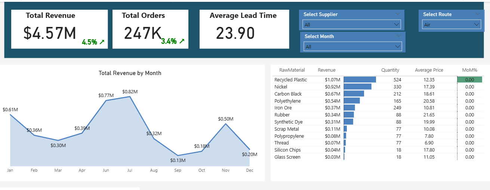

# Supply Chain Distribution Analysis Report

## Project Background

Raw materials distributor that sources commodities from suppliers across 10 countries and resells them to manufacturing customers worldwide with 13 distinct raw materials including Coal, Nickel, Glass Screen, Recycled Plastic, and other industrial commodities.

Insights and recommendations are provided on the following key areas:

- **Sales Trends Analysis**: Evaluation of revenue patterns, focusing on monthly performance, order volume, and growth trajectories.

- **Product Level Performance**: Analysis of the 13 raw materials, understanding their contribution to revenue and identifying high-value vs. high-volume products.

- **Supplier Risk Assessment**: Evaluation of supplier concentration, lead times, and geographic distribution to identify operational vulnerabilities.

- **Route Comparisons**: Analysis of Sea vs. Air shipping routes and their impact on lead times and costs.

An interactive Power BI dashboard can be downloaded [here].

The SQL queries utilized to inspect and perform quality checks can be found [here].

The SQL queries utilized to clean, organize, and prepare data for the dashboard can be found [here].

Targeted SQL queries regarding various business questions can be found [here].

---

## Executive Summary

### Overview of Findings
After peaking in June 2024 at $1.45M, the company's sales experienced a severe and continuous decline, reaching a low of $0.20M by December 2024 - an 85% drop from peak performance. Key performance indicators showed alarming year-over-year decreases in the second half of the year: order volume declined by 80% and revenue fell by 85% from H1 to H2 2024. The following sections will explore contributing factors and highlight key opportunity areas for stabilization and recovery.

Below is the overview page from the Power BI dashboard and more examples are included throughout the report. The entire interactive dashboard can be downloaded [here].

---

## Sales Trends

- **The company's sales peaked in June 2024** with approximately 85,000 orders totaling $1.45M in monthly revenue. This represented the high-water mark for the business in the analyzed period.

- **Beginning in July 2024, revenue declined consistently** for six consecutive months. Revenue hit a company low in December 2024, with the company earning just $0.20M - a catastrophic 85% decline from the June peak.

- **April 2024 showed strong performance** with $1.15M in revenue and 85K orders, demonstrating 5.4% revenue growth and 14.5% order growth compared to the previous month. This suggests the business was on a healthy trajectory before the H2 collapse.

- **Order volume mirrored revenue decline**, dropping from approximately 100K orders in January to just 20K by December, confirming this is primarily a demand problem rather than a pricing issue.

- **Average order value remained relatively stable** throughout the year, suggesting customer purchase behavior per transaction did not change significantly - the decline is driven by lost customers or reduced order frequency.

---

## Product Performance

- **85% of total revenue comes from just five raw materials**: Nickel ($1.83M), Recycled Plastic ($1.46M), Silicon Chips ($1.37M), Rubber ($1.34M), and Polyethylene ($1.13M). These five products accounted for $7.13M in revenue, representing significant concentration risk.

- **Nickel is the revenue leader** at $1.83M (17% of total revenue) with an average unit price of $17.32. Despite having fewer orders than Recycled Plastic, Nickel generates 25% more revenue due to its premium pricing.

- **Recycled Plastic shows the highest order volume** with 93K orders (tied with Nickel) and $1.46M in revenue (13.6% of total). This product demonstrates strong market demand and should be a focus for expansion.

- **Rubber delivers high value per transaction** at $23.12 average unit price - the highest among all materials. With only 45K orders generating $1.34M, Rubber represents a premium product category worth protecting.

- **Glass Screen significantly underperforms**, contributing less than 2% of total revenue ($223K) despite being a commonly needed industrial material. At $12.11 average price, it may be priced too low or facing strong competition.

- **Coal shows concerning performance** with only $208K in revenue (1.9% of total) and an average price of just $4.91 - the lowest of all materials. The company may want to reconsider carrying this low-margin product.

- **In April 2024, Synthetic Dye showed exceptional growth** with +25% month-over-month increase, while Thread grew +30% MoM, indicating emerging opportunities in these materials.

---

## Supplier Risk Assessment

- **The company relies on 10 suppliers across 10 countries**, creating both diversification benefits and coordination challenges. Geographic spread includes Australia, UAE, China, and others across multiple continents.

- **Africa Steel Suppliers dominates volume** with 150 units supplied (24% of total volume), nearly double the next largest supplier (Middle East Alloys at 91 units). This concentration creates significant operational risk if Africa Steel experiences disruptions.

- **Top 3 suppliers control 52% of volume**: Africa Steel Suppliers (150 units), Middle East Alloys (91 units), and East Asia Plastics (88 units). Loss of any of these would severely impact operations.

- **Coal has single-source dependency**, being supplied by only one vendor. This creates the highest risk scenario - if that supplier fails, the entire Coal product line stops.

- **Sea route handles all 13 raw materials** while Air route covers only 12 materials (excluding Coal). This suggests Coal's weight/volume makes air freight economically unviable, but also limits flexibility in rush situations.

- **Average lead time is 19.21 days**, which requires careful inventory planning. Longer lead times mean higher safety stock requirements and more working capital tied up in inventory.

- **Geographic concentration in specific regions** creates geopolitical risk. Diversification across more stable regions could reduce supply chain vulnerability.

---

## Route Comparisons

- **Sea route is the dominant shipping method**, handling 13 out of 13 raw materials. This indicates cost advantages for bulk commodity shipments.

- **Air route covers 12 materials** with the notable exception of Coal. The exclusion of Coal from air makes air shipping economically prohibitive.

- **Sea route likely offers significant cost savings** but at the expense of flexibility. Average lead times of 19+ days require larger safety stock compared to air alternatives.

- **No materials are exclusively air-shipped**, suggesting even time-sensitive products use sea freight, possibly indicating cost sensitivity in the customer base or competitive pricing pressure.

- **Route diversification provides operational resilience** - if air freight becomes necessary for rush orders, the infrastructure exists for most materials.

- **Sea**

- **Air**

